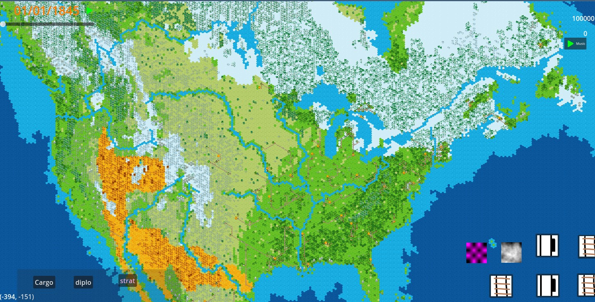
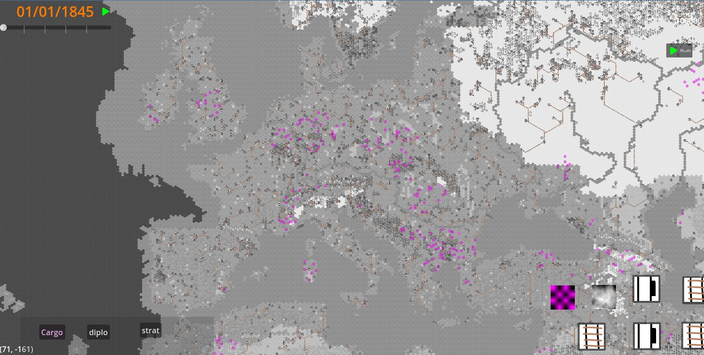
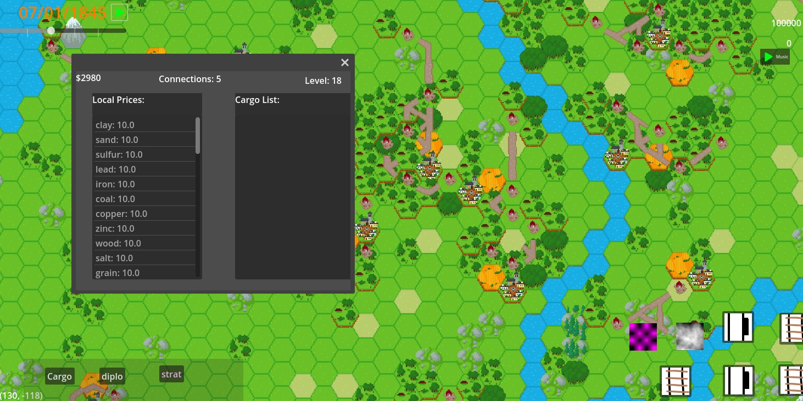
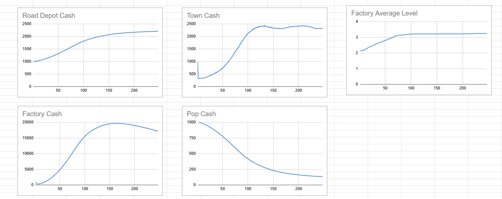
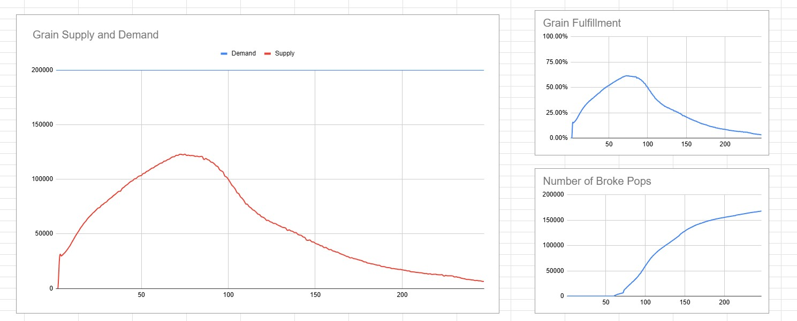
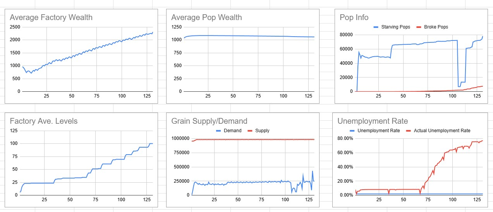

Screenshot of the USA. The world map made with real life terrain, moisture levels, and forestry information.

The copper deposits of Europe with historical deposits.

The economic panel for a woodcutter.

Some simulation data from successful and unsuccessful simulations. 

